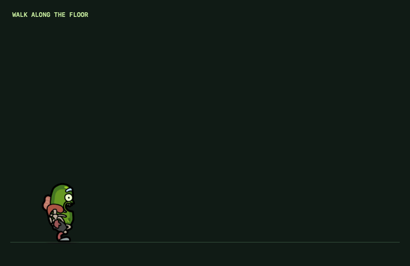

# Peons

[](https://github.com/rpapagiannis/peons/releases/latest)
[](#homebrew)
[](https://github.com/rpapagiannis/peons/actions/workflows/ci.yml)



A native macOS desktop companion featuring **Rat Suit Rick**. He walks, jumps, roams, and can be picked up and thrown across every connected monitor. No accounts, no network calls, and no special permissions.

## Install

Requires an Apple Silicon Mac running macOS 14 or later.

### Download

1. Download the latest `Peons-…-arm64-preview.dmg` from the [Releases page](https://github.com/rpapagiannis/peons/releases/latest).
2. Open the disk image and drag **Peons.app** onto the **Applications** shortcut.
3. Launch Peons from Applications. Rick lands on the desktop floor, a pickle icon appears in the menu bar, and the controls window opens on the very first launch.

**First launch.** This preview is ad-hoc signed rather than notarized, so macOS blocks the first launch with a warning that it cannot verify the app, or on some systems that the app is damaged. Open **System Settings → Privacy & Security**, scroll to the Security section, click **Open Anyway** next to Peons, and confirm. On macOS 14, Control-clicking the app and choosing **Open** also works. If macOS insists the app is damaged, clear the download's quarantine flag and launch again:

```sh
xattr -d com.apple.quarantine /Applications/Peons.app
```

This is a one-time step per version and goes away once releases are Developer ID signed and notarized.

### Homebrew

```sh
brew install --cask rpapagiannis/peons/peons
```

The cask in [rpapagiannis/homebrew-peons](https://github.com/rpapagiannis/homebrew-peons) installs the same disk image, so the same first-launch approval applies. Homebrew 6 has no option to skip quarantine, and because an ad-hoc signature changes with every build, Homebrew cannot carry the approval over to upgrades either, so each new version asks once. Homebrew 6 trusts only this cask when it is installed by its fully qualified name, so no separate `brew tap` or `brew trust` step is needed. Update later with `brew upgrade --cask peons`.

### Verify a download

Every release ships a `.sha256` file next to the disk image. From the folder holding both:

```sh
shasum -a 256 -c Peons-*.dmg.sha256
```

## Using Peons

Tiny is the only size (135.68 × 180.2 screen points for the transparent canvas). Older saved character and size choices automatically migrate to Rat Suit Rick at Tiny size.

Open **Peons.app** in your Applications folder. Click Rick to play; click another app or press Escape to return to roaming. The pickle icon in the menu bar opens the menu. The controls window shows Rick and the voice controls, with no character or size selector.

In free roam, Rick mixes walking and resting with occasional high jumps and rarer portal trips to a different spot, including other connected monitors. He waits between actions and lets throws and landings finish first. Hover over him to keep him easy to catch; autonomous actions pause while you interact with him, open his menu, or put him down for a nap. Voices continue to follow the existing occasional-chatter setting.

| Control | Action |
| --- | --- |
| Click Rick | Take keyboard control |
| A / D or Left / Right | Walk |
| S or Down | Face the viewer |
| Shift + movement | Move faster |
| W / Up / Space or double-click | Jump; press again in midair for a second jump |
| Drag and release | Pick up and throw with momentum |
| P | Portal to another spot, including another monitor |
| E | Play the next voice line |
| M | Mute or unmute voices |
| Escape | Release keyboard control and roam |
| Right-click Rick | Controls, speed, nap, voices, hide, summon, quit |
| C or H while controlling | Open Rick controls |

All connected monitors form one desktop. Rick walks, jumps, or flies across internal monitor seams without bouncing or wrapping. Wrapping happens only beyond the far left and right edges of the combined desktop. Ground travel follows each monitor's usable bottom edge, stepping to the receiving floor when the monitors have different vertical offsets. The screen bottom is the only platform; application windows and boxes are not detected. Disconnecting a monitor brings Rick back onto a remaining screen.

Gravity brings unsupported Rick down. A normal jump rises about 180–380 screen points depending on the current display. Throws bounce, lose energy, and settle. Keyboard input stays local to the focused pet panel. Speed, volume, mute, and occasional-chatter preferences are remembered.

This is a local, ad-hoc-signed Apple Silicon app for macOS 14+. The app makes no network calls and requires no Accessibility, Input Monitoring, or screen recording permission. It does not install a login item. System security surfaces and some exclusive fullscreen apps can cover floating windows.

## Build from source

Requires Apple's Command Line Tools:

```sh
./build.sh
./test.sh
open "build/Peons.app"
```

Builds produce a fresh `build/Peons.app` containing only Rick's atlas and voice assets, with a Rick app icon generated from that atlas. Build and test compiler caches are temporary and removed when each command exits. Retired characters, rolling animations, prototype renderers, and their assets have been removed from the source tree. Rebuilding does not install the bundle into Applications: replace the installed copy and restart it to use an updated build.

To package locally, run `./scripts/package_release.sh` after building; it writes `dist/Peons-<version>-<build>-arm64-preview.dmg` and its SHA-256 checksum. Releases are published by GitHub Actions: pushing a tag named `v<version>-<build>` that matches `build.sh` (for example `v4.2.2-9`) builds, tests, packages, and attaches the DMG to a GitHub release together with the matching `CHANGELOG.md` section, and can update the Homebrew cask. Running the workflow manually performs a dry run that uploads the DMG as a workflow artifact without publishing. See [distribution/README.md](distribution/README.md). Preview builds are ad-hoc signed; Developer ID signing and notarization are still to do, and the redistribution basis for the bundled artwork and recordings is recorded in [assets/ATTRIBUTION.md](assets/ATTRIBUTION.md).

`Sources/Characters.swift` defines the supported catalog and voice pack. `PetModel.swift` owns shared physics, the fixed desktop size, and monitor geometry. `SpriteRenderer.swift` draws the artwork and effects. `App.swift` provides the native panel, controls, and migration of old preferences.

Development exports:

```sh
"build/Peons.app/Contents/MacOS/Peons" --render /absolute/preview.png
"build/Peons.app/Contents/MacOS/Peons" --export-demo /absolute/preview.gif
```

`--diagnostics /absolute/path.json` writes only this app's internal state and display geometry. It is disabled in normal launches. The legacy bundle identifier `local.rafail.pickle-rick-pet` and migration of saved character/size choices are retained for compatibility with earlier installations.

The Rick voice selection and comparison are documented in `research/VOICE_PACKS.md`. To reproduce the balanced voice files from the pinned original recordings, run `swift scripts/prepare_rick_voice.swift`, then rebuild. This preparation step uses macOS audio decoding services and does not play audio.

Artwork and voice provenance are in `assets/ATTRIBUTION.md`. This is an unofficial personal project; the character artwork belongs to its respective rights holders. The original atlas is bundled unmodified and existing poses are selected at runtime. Recorded voice clips play locally with matching speech bubbles.

## Project layout

- `Sources/` and `Tests/`: the current Rick app and its regression coverage.
- `assets/`: the active sprite atlas, 17 normalized recordings, original recordings, and attribution.
- `research/`: movement rationale and the pinned Rick voice selection/provenance needed to reproduce the assets.
- `scripts/` and `distribution/`: voice preparation, DMG packaging, the Homebrew cask template, and the release process notes.
- `CHANGELOG.md`: what changed in each release; the release workflow copies the matching section into the GitHub release notes.
- `docs/`: the demo animation shown above, exported with `--export-demo`.
- `.github/workflows/`: CI for pushes to `main` and pull requests, and the tag-triggered release that builds, tests, packages, and publishes the DMG, with a manual dry-run mode.
- `dist/`: the latest locally packaged preview DMG and its checksum. Not tracked in git; release downloads live on GitHub Releases.

Generated app bundles are disposable; rebuild them with `./build.sh`. Old renamed app copies, obsolete installers, and prototype snapshots are not kept in this directory.
